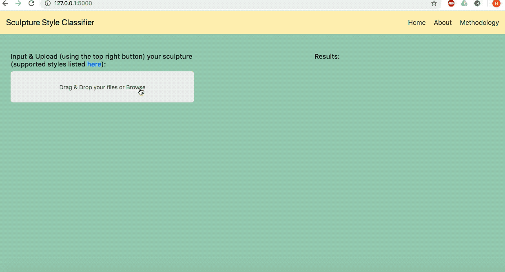

# Sculpture Style Classification App

This app allows the user to upload an image of a sculpture and returns the probability of it
belonging to a number of art styles. The details of the model and how it was made can be
found [here](https://github.com/HarryShomer/Sculpture-Period-Classification). 

## Example

Here is an example using the sculpture _David_ by Michelangelo, which belongs to the High Renaissance style.

